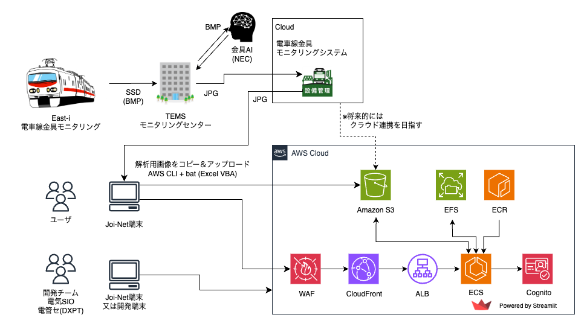

<div markdown="1" align="center">
<h1>Contact-wire Inspection System

〜 トロリ線摩耗判定支援システム 〜</h1>

このシステムは、検測車(East-i)で撮影した電車線金具モニタリング画像を利用して、トロリ線の局部摩耗を探索することをサポートするアプリです。

このアプリは AWS クラウド上で構築することを想定しています。もしローカル環境で Streamlit を実行する場合は、AWS CLI の設定が必要になりますので、管理者に問い合わせてください。

</div>

# ユーザ向けガイド

## アプリの起動方法

アプリは https://esio-cis.com にアクセスすると起動できます。

## アプリの利用方法

アプリには以下の機能があります。

1. 摩耗判定システム
2. 解析結果閲覧システム
3. データ管理
4. ストレージビューワ（参考：開発者向け）
5. 解析ログ操作

# 開発者向け

このアプリのアーキテクチャは以下のようになっています。



## コードをリポジトリから Clone する

最初にリポジトリをクローンします。
プライベートリポジトリのため、http接続でCloneするにはTokenが必要になります。

GitHubのTokenを取得する方法は[参考になるサイト](https://dev.classmethod.jp/articles/github-personal-access-tokens/)か、[GitHubの公式ドキュメント](https://docs.github.com/jp/authentication/keeping-your-account-and-data-secure/creating-a-personal-access-token)を参照して、設定した後に、以下のコマンドを実行します。

```bash
git clone https://github.com/ESIO-EPTMC-DXPT/contact-wire-inspection-system.git
cd ./contact-wire-inspection-system
```

## リポジトリの構造を確認する

リポジトリ内のファイルは以下のようになっています。
現在はStreamlitアプリをコンテナ化して利用しているため、ほとんど app ディレクトリのみを利用しています。

```
.
├── README.md                             # Readme
├── app                                   # Streamlitアプリのディレクトリ
|   ├── CIS_App.py                        # Streamlitアプリのメインファイル
|   ├── Dockerfile                        # コンテナイメージファイル
|   ├── docker-compose.yml                # コンテナの起動用ファイル
|   ├── requirements.txt                  # 依存パッケージのリスト
|   ├── .streamlit                        # streamlitの設定ファイル
|   ├── config.yml                        # アプリの設定ファイル
|   ├── pages                             # 各機能ごとのディレクトリ
|   |    ├── 1_⚡_摩耗判定システム.py         # 摩耗判定メインファイル
|   |    ├── 2_📈_解析結果閲覧システム.py     # グラフ・画像を出力
|   |    ├── 4_🔎_異常箇所をチェックする.py   # 異常摩耗箇所をチェックする　※未実装
|   |    ├── 10_⚙️_データ管理.py             # データ管理メインファイル
|   |    ├── 81_📁_ストレージビューワ.py      # ローカルファイル操作（開発者用）
|   |    ├── 98_📝_解析ログ操作.py           # 操作ログを確認する
|   |    └── 99_🍣_python_コードを見る.py    # (おまけ) コード参照用
|   ├── efs                               # ファイルシステムのマウントポイント (自動作成)
|   |    ├── images                       # 画像ファイル
|   |    ├── output                       # 出力ファイル
|   |    ├── logs                         # ログファイル
|   |    └── TDM                          # 画像ファイル名→キロ程変換情報を管理
|   ├── src                               # コードのソースファイル
|   |    ├── kalman_calc.py               # カルマンフィルタ計算用のラッパーファイル
|   |    ├── kalman.py                    # カルマンフィルタの計算用コアクラス用ファイル
|   |    ├── similar_pixel_calc.py        # 類似ピクセル計算用のラッパーファイル
|   |    ├── similar_pixel.py             # 類似ピクセルの計算用コアクラス用ファイル
|   |    ├── trolley.py                   # トロリ線パラメータ用クラス用ファイル
|   |    ├── helpers.py                   # 読み込み・リストなどのUtil処理用ファイル
|   |    ├── visualize.py                 # 可視化用ファイル
|   |    ├── config.py                    # 設定パラメータ処理用ファイル
|   |    ├── logger.py                    # ログ用ファイル
|   |    ├── auth_aws.py                  # 認証用ファイル(Cognito用)
|   |    ├── auth.py                      # 認証用ファイル(Streamlit-Authenticator用)
|   |    ├── create_yml.py                # ユーザー情報用ファイル(Streamlit-Authenticator)
|   |    └── get_strun_url.py             # ストリングURL用ファイル(Jupyter-notebook用)
|   ├── sh/                               # 管理用のスクリプト
|   └── README_forStreamlit.ipynb         # 使い方の説明＆実行用　※コンテナ化により不要
├── docs/                                 # ドキュメント
├── ecr-push.sh                           # ECRにコンテナをプッシュするスクリプト
├── bin/                                  # cdk用（作成中）
├── lib/                                  # cdk用（作成中）
├── cdk.json                              # cdk用設定ファイル（作成中）
.
.
.
```

## はじめて GitHub からクローンするとき

### 1. SSH鍵を生成する

```bash
# SSH鍵を生成（メールアドレスは自分のJoi-Netアドレスに変更してください）
ssh-keygen -t ed25519 -C "your_email@example.com"

# または、古いシステムでed25519がサポートされていない場合
ssh-keygen -t rsa -b 4096 -C "your_email@example.com"
```

生成時に表示される質問:
- 鍵の保存場所（デフォルトでOK: Enter）
- パスフレーズ（任意: セキュリティ向上のため設定推奨、なくてもOK）

### 2. SSH鍵をSSHエージェントに追加する

```bash
# SSHエージェントをバックグラウンドで起動
eval "$(ssh-agent -s)"

# SSH鍵をエージェントに追加
ssh-add ~/.ssh/id_ed25519  # または ~/.ssh/id_rsa
```

### 3. 公開鍵をGitHubに追加する

```bash
# 公開鍵をクリップボードにコピー
cat ~/.ssh/id_ed25519.pub  # または ~/.ssh/id_rsa.pub
```

表示された内容をコピーして:

1. GitHubにログイン
2. 右上のプロフィールアイコン → Settings をクリック
3. 左側のサイドバーで「SSH and GPG keys」をクリック
4. 「New SSH key」ボタンをクリック
5. タイトルに識別しやすい名前（例: 「Work Laptop」）を入力
6. 「Key」フィールドに先ほどコピーした公開鍵を貼り付け
7. 「Add SSH key」をクリック

### 4. git clone する
以下のコマンドでリポジトリをクローンします。
（SSHパスを指定）

途中で確認が求められたら yes にします。

```bash
git clone git@github.com:esioEptmcDxpt/contact-wire-inspection-system.git
```

### 5. リモートURLをSSH形式に変更する

```bash
# 現在のリモートURLを確認
git remote -v

# リモートURLをSSH形式に変更
git remote set-url origin git@github.com:esioEptmcDxpt/green-finder.git
```

### 6. 接続をテストする

```bash
ssh -T git@github.com
```

「Hi username! You've successfully authenticated...」というメッセージが表示されれば成功です。

### 7. プッシュしてみる

プッシュする前にブランチを作成して切り替えます。

```bash
git switch -c feature/test
```

更新内容をステージングした後、コミットします

```bash
git add .    # 追加したファイルを全て git の対象に追加する
git stage .    # 変更されたファイルをコミットする状態にステージングします
git commit -m "hogehoge"    # コメントを追加してコミットします
```

初めてコミットするときは、ユーザ名・アドレスの設定が求められるので、設定した後に、もう一度コミットしましょう。

```bash
git config --global user.name "Your Name"
git config --global user.email you@example.com
```


```bash
git push --set-upstream origin feature/test
```

注意: 初回接続時にホストの信頼性確認メッセージが表示されることがありますが、「yes」と入力して続行してください。

## 認証情報の管理について

このアプリではAWS Cognitoを使用したユーザー認証機能を実装しています。以下は認証に関する重要な情報です。

### 認証の仕組み

1. **AWS Cognitoによる認証**:

   - アプリはAWS Cognitoのユーザープールを使用してユーザー認証を行います
   - OAuth 2.0のフローを使用し、コードグラント方式で認証を実装
   - 認証後に得られたアクセストークンとリフレッシュトークンをローカルストレージに保存

2. **マルチページ環境での認証維持**:
   - Streamlitのマルチページアプリケーションでもログイン状態を維持
   - ブラウザIDを使用して異なるセッション間での識別を実現
   - ページ切り替えやリロード時でも認証状態が保持される仕様

### ディレクトリ構成

認証関連の一時ファイルは以下のディレクトリに保存されます：

```
app/
├── browser_id_storage/      # ブラウザID情報を保存するディレクトリ
└── token_storage/           # 認証トークン情報を保存するディレクトリ
```

これらのディレクトリは自動生成されます。

### 認証状態の永続化

1. **ブラウザIDの管理**:

   - 各ブラウザセッションに一意のIDを割り当て
   - `browser_id_storage`ディレクトリにファイルとして保存
   - ログアウト後も維持され、同一ユーザーの識別に使用（意図的な設計）

2. **トークンの管理**:
   - 認証トークンは`token_storage`ディレクトリに暗号化されずに保存
   - ログアウト時に完全に削除される
   - 開発環境でのみ使用し、本番環境ではより安全な方法（セッションマネージャー等）を検討すべき

### ローカル開発環境での認証設定

1. ローカル環境で認証を使用するには、`app/.streamlit/secrets.toml`を編集：

```toml
[cognito]
client_id = "YOUR_COGNITO_CLIENT_ID"
client_secret = "YOUR_COGNITO_CLIENT_SECRET"
aws_region = "ap-northeast-1"
user_pool_id = "YOUR_USER_POOL_ID"
domain = "YOUR_COGNITO_DOMAIN"
redirect_uri = "http://localhost:8501"  # ローカル開発時はこのURIを使用
```

2. 本番環境の設定に戻す前に、`redirect_uri`を元の値に戻すことを忘れないでください。

### セキュリティ上の注意

1. 開発環境でトークンをファイルに保存することは、セキュリティリスクを伴います
2. 本番環境では適切なセッション管理やトークン保存方法を検討してください
3. 開発環境のトークンファイルは`.gitignore`に追加し、リポジトリにコミットしないようにしてください

## ローカル環境でコンテナを起動してテストする

(前提) AWS CLI の設定は完了していることを確認してください。

アプリへのログイン認証に AWS Cognito を利用しています。 `app/.streamlit/secrets.toml` に認証情報を設定しますが、ECS 環境用の内容となっているため、ローカル用に以下のように設定します。
ただし、ECR にプッシュする前に必ず元に戻しましょう。

```toml
[cognito]
redirect_uri = "http://localhost:8501"
```

コンテナを起動するときには、 app ディレクトリで以下のコマンドを実行します。

```bash
docker-compose build --no-cache
docker-compose up
```

ターミナル上で Docker コンテナが起動したら、 `http://localhost:8501` にアクセスしてアプリを確認します。
コンテナを停止するときは、 `ctrl + c` で停止します。

ターミナル上でコンテナを動作させずに、バックグラウンドで実行したいときは、以下のコマンドを実行します。

```bash
docker-compose up -d
```

コンテナを停止するときは、以下のコマンドを実行します。

```bash
docker-compose down
```

### (参考) Docker コンテナで使用するコマンドのメモ

```bash
# コンテナを停止して削除
docker-compose down

# コンテナイメージを再ビルド
docker-compose build --no-cache

# コンテナを起動
docker-compose up

# コンテナを起動（バックグラウンドで実行）
docker-compose up -d

```

定期的なお掃除用のコマンド
（コンテナイメージでストレージを圧迫しないため）

```bash
# システム全体（未使用のコンテナ含む）のクリーンアップ
docker system prune -a --force
# 使用していないコンテナイメージを削除
docker image prune

# 使用していないシステムリソースの削除
docker system prune

# 強制的に全てのコンテナイメージを削除するときに実行する。
docker rmi $(docker images -q)
```

## ECRにコンテナをプッシュする

開発が完了したら、 `app/.streamlit/secrets.toml` を元に戻した後、以下のスクリプトを実行して ECR にコンテナをプッシュします。
このコマンドはプロジェクトのルートディレクトリ（ `contact-wire-inspection-system` ）で実行します。

```bash
source ./ecr-push.sh
```

## (開発用)メモ

今後のアプリ化を容易にしつつ、継続的な改変を行うため、以下に留意して改善していく。

参考文献：

- https://awesome-streamlit.readthedocs.io/en/latest/index.html
- https://towardsdatascience.com/intermediate-streamlit-d5a1381daa65

1. 変数名：エンドユーザーに分かりやすい名称にフォーマットし、format_func で呼び出す

   - 辞書と組み合わせて値の対応関係を作成しておくのと、format_func=、で呼び出せる。
     候補：camera 種別、画像ディレクトリ置き場のリスト表示
   - 変更の理由
     - Pandas 等の変数名の定義とアプリ表示上の名称が異なるため、その対応関係を整理すると構造的に改変がユーザー、開発者双方に取って容易に理解できるものとなる。

2. キャッシュを用いて読み込み速度を改善

   - アプリで呼び出される関数を細かく分割し、各関数に st.cache デコレータを用いることで読み込み速度を改善
   - キャッシュによる読み込みは update が続いており、現在@st.cache_data と@st.cache_resource に分割
     - https://docs.streamlit.io/library/advanced-features/caching
     - ユースケースに応じて使い分ける。
     - Version upgrade すると動かなくなることがあるので、当面は v1.10 以下を推奨。

3. 動的ウイジェットの作成

   - 何かを選択する際に、後続の処理に影響を与える場合、その挙動を組み込んでおく
     - a, b, c の 3 つを使って散布図を作成したいとする。
     - a を X 軸として選んだ場合、Y 軸の選択肢は b, c のいずれかに絞られるため、それを内部変数として作成しておき、選択肢を Y 軸の選択の選択肢を減らす

4. 定期的にリファクタリング、コードの記述やテストを行う

   - 100 行を超えてくる場合、関数を別の場所から呼び出す
   - ストリームライト関数とヘルパー関数のみをインポートします
   - ストリームライトオブジェクト、つまりビジュアライゼーションやウィジェットに入力されていない変数を、コードの次の行で作成しないでください (データ読み込み関数を除く)

5. black、flake8 など、コード整形と文法チェックを行い、コーディング規約に従って記述
   - コーディングルールを決めておくことで見通しが良くなります。
   - 基本的には black によるコードの自動整形＋ flake8 によるチェックで事足ります。
   - Jupyter notebook 状でのインストール手順は下記を参考にしてください。

## コードフォーマッター black の導入と修正

ここでは Python のコードフォーマットを自動で整形してくれる Black の Jupyter notebook への導入手順と修正手順を示します。

1. Jupyter notebook のマジックコマンド、もしくはターミナルから Black をインストール

```
pip install black
```

2. black を使い、コードの自動フォーマットを実行します。

```
$ black <your testfile>.py
reformatted main.py

All done! ✨ 🍰 ✨
1 file reformatted.
```

上の flake8 と組み合わせチェックすることで、チェック回数やコーディングルールの把握を進めることができます。

## コーディング規約のチェック手順

SageMaker Notebook instance を想定

1. Jupyter notebook からターミナルを起動し、flake8 をインストール

```
pip install flake8
```

2. 文法チェックを行うファイルを指定し、flake8 を実行

```
flake8 <testfile>.py --max-line-length 200
```

- max-line-length は 1 行の長さを制限するものです。pep8 では 79 文字まで、としていますが他の規約に比較し、優先度が落ちるため、長めの文字数に設定します。

3. エラーに従ってファイルを更新します。

```
$ flake8 main.py
main.py:2:1: F401 'openpyxl' imported but unused
```

上記では 2 行目で import されたが使われていないライブラリが存在することを提示してくれます。
各エラーの詳細と修正方針については、公式ページを参照してください。
https://flake8.pycqa.org/en/2.6.0/warnings.html
